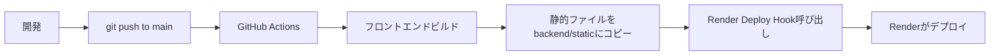

# デプロイガイド

このドキュメントでは、ヨンショーゲンをRenderにデプロイする手順を説明します。

## デプロイ構成

```
Render Web Service
├── フロントエンド (React) - 静的ファイルとして配信
└── バックエンド (FastAPI) - API + WebSocket + 静的ファイル配信
```

フロントエンドとバックエンドを1つのRenderサービスで運用します。

## 前提条件

- GitHubアカウント
- Renderアカウント (https://render.com)
- リポジトリがGitHubにpushされていること

## デプロイ手順

### 1. Renderでサービスを作成

1. [Render Dashboard](https://dashboard.render.com/) にログイン
2. "New +" → "Web Service" をクリック
3. GitHubリポジトリを接続
4. このリポジトリを選択

### 2. サービス設定

**基本設定:**
- Name: `yonshogen` (任意の名前)
- Region: `Oregon` (最も近いリージョン)
- Branch: `main`
- Runtime: `Python 3`

**ビルド設定:**
- Build Command: `pip install -r backend/requirements.txt`
- Start Command: `cd backend && uvicorn main:app --host 0.0.0.0 --port $PORT`

**プラン:**
- Free (無料プラン)

### 3. 環境変数設定（オプション）

現時点では環境変数は不要ですが、将来的に必要になる可能性があります。

### 4. デプロイ

"Create Web Service" をクリックすると、自動的にデプロイが開始されます。

### 5. GitHub Actionsの設定（CI/CD）

#### 5-1. Render Deploy Hookを取得

1. Renderダッシュボードで作成したサービスを開く
2. "Settings" タブをクリック
3. "Deploy Hook" セクションを見つける
4. "Create Deploy Hook" をクリック
5. 表示されたURLをコピー

#### 5-2. GitHubシークレットに設定

1. GitHubリポジトリページを開く
2. "Settings" → "Secrets and variables" → "Actions" をクリック
3. "New repository secret" をクリック
4. Name: `RENDER_DEPLOY_HOOK_URL`
5. Secret: コピーしたDeploy Hook URLを貼り付け
6. "Add secret" をクリック

#### 5-3. mainブランチにpush

```bash
git push origin main
```

これで、mainブランチにpushするたびに自動的にデプロイされます。

## デプロイ後の確認

1. Renderダッシュボードで "Logs" を確認
2. デプロイが完了したら、表示されるURLにアクセス
3. ヘルスチェック: `https://your-app.onrender.com/api/health`
4. フロントエンド: `https://your-app.onrender.com/`

## トラブルシューティング

### ビルドエラー

**症状:** ビルドが失敗する

**解決策:**
- `backend/requirements.txt` が正しいか確認
- Python 3のバージョンを確認
- ログを確認してエラー内容を特定

### 静的ファイルが見つからない

**症状:** フロントエンドが404エラー

**解決策:**
- GitHub Actionsのログを確認
- `backend/static` ディレクトリが正しく作成されているか確認
- `main.py` の静的ファイルマウント設定を確認

### WebSocketが動作しない

**症状:** チャット機能が動作しない

**解決策:**
- ブラウザのコンソールでWebSocketエラーを確認
- RenderではWebSocketはデフォルトで有効なので、問題があればサポートに連絡

### 無料プランの制限

**症状:** サービスがスリープする

**解決策:**
- 無料プランでは15分間アクセスがないとスリープします
- 初回アクセス時に起動するまで時間がかかります（最大30秒）
- 有料プラン ($7/month) にアップグレードすると常時起動します

## デプロイフロー

### 自動デプロイ（推奨）



### 手動デプロイ

1. ローカルでフロントエンドをビルド:
   ```bash
   cd axis_server
   npm run build
   ```

2. 静的ファイルをコピー:
   ```bash
   mkdir -p backend/static
   cp -r axis_server/dist/* backend/static/
   ```

3. Gitにコミット&プッシュ:
   ```bash
   git add backend/static
   git commit -m "Add frontend build"
   git push origin main
   ```

4. Renderが自動的にデプロイ

## カスタムドメイン設定（オプション）

1. Renderダッシュボードで "Settings" → "Custom Domain" をクリック
2. ドメインを入力
3. DNSレコードを設定
4. SSL証明書が自動的に発行されます

## まとめ

- Render 1つで完結
- GitHub Actionsで自動デプロイ
- 無料プランで開始可能
- WebSocket対応
- HTTPS自動対応

---
最終更新: 2025-10-08
